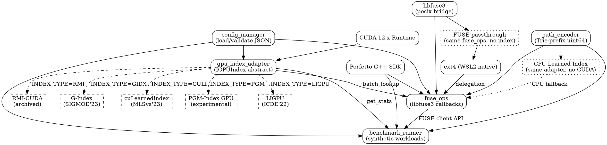

# 📘 GPULearnedFS 系统规范 (SYSSPEC v1.0)

> **文档状态**: DRAFT → READY_FOR_CODEGEN  
> **适用平台**: WSL2 (Ubuntu 24.04.2) + CUDA 12.x + libfuse3  
> **核心目标**: 验证"全GPU Learned Index元数据映射"在多模态训练场景下的吞吐收益

---

## 🏗️ 系统架构总览

```
┌─────────────────────────────────────┐
│  POSIX Application (benchmark)      │
└────────────┬────────────────────────┘
             │ open()/stat()/readdir()
┌────────────▼────────────────────────┐
│  FUSE Layer (libfuse3)              │
│  • fuse_ops_t 回调注册               │
│  • 内置埋点 + Perfetto TrackEvent   │
└────────────┬────────────────────────┘
             │ GPULearnedFS_Ops
┌────────────▼────────────────────────┐
│  Core FS Module                     │
│  • PathEncoder (Trie-prefix)        │
│  • MetadataCache (full-resident)    │
│  • ErrorMapper (ENOENT/EACCES only) │
└────────────┬────────────────────────┘
             │ uint64_t key → lookup()
┌────────────▼────────────────────────┐
│  GPU Index Adapter Layer (M1-C)     │
│  ┌─────────────────────────────┐   │
│  │ class IGPUIndex {            │   │
│  │   + train(), batch_lookup()  │   │
│  │   + get_stats(), profile()   │   │
│  │   + save(), load()           │   │
│  │ }                            │   │
│  └─────────────────────────────┘   │
│  运行时绑定:                        │
│  • RMI-CUDA | G-Index | cuLearnedIndex │
│  • PGM-Index(GPU) | LIGPU          │
└────────────┬────────────────────────┘
             │ CUDA Kernel Async Stream
┌────────────▼────────────────────────┐
│  GPU Runtime + Ext4 Backend         │
│  • cudaStream_t + callback          │
│  • direct I/O to /home/user/data    │
└─────────────────────────────────────┘
```

---

## 🔹 模块1: `path_encoder` — 路径→整数键编码

```markdown
# path_encoder Specification

## [RELY]
- struct: `EncodedKey { uint64_t value; uint32_t depth; }`
- external: `std::string normalize_path(const std::string&)` (移除冗余`/./`, `/../`)
- lock: none (stateless encoder)

## [GUARANTEE]
- API: `EncodedKey encode_path(const std::string& path, const PathConfig& cfg);`
- Promise: 
  • Same path + same cfg → same key (deterministic)
  • Parent path's key is prefix of child's key (Trie property)
  • Encoding time: O(path_depth), no heap alloc after init

## 功能规范 (Functionality)
- Pre-condition:
  • path: absolute path starting with mount_point, NULL-terminated
  • cfg: valid TrieConfig { max_depth: [1,32], bits_per_level: [4,16] }
  • system: encoder initialized with dataset schema

- Post-condition:
  • Case 1 (Valid path): 
    - Return EncodedKey with value ∈ [0, 2^64-1]
    - value = Σ (level_i_code << (bits_per_level * (max_depth - i)))
  • Case 2 (Path too deep > max_depth): 
    - Return {INVALID_KEY, 0}, set errno=ENAMETOOLONG (internal)
  • Case 3 (Invalid char in path): 
    - Return {INVALID_KEY, 0}, set errno=EINVAL

- Invariant:
  • encode_path(a) == encode_path(b) ⇔ a == b (injective within dataset)
  • key space utilization ≥ 80% for uniform directory depth

- System Algorithm:
  1. Split path by '/', skip mount_point prefix
  2. For each component i ∈ [0, depth-1]:
     a. Hash component to [0, 2^bits_per_level) via BobHash
     b. Shift-OR into result: `key |= (hash_i << (bits * (max_depth - i)))`
  3. Pack depth into lower 6 bits of value (reserved)
  4. Return EncodedKey{key, depth}

## 并发规范 (Concurrency)
- Locking Pre-condition: none (stateless)
- Locking Post-condition: none
- Locking Algorithm: N/A (pure function, thread-safe by design)
```

---

## 🔹 模块2: `gpu_index_adapter` — 统一GPU索引接口

```markdown
# gpu_index_adapter Specification

## [RELY]
- struct: 
  ```cpp
  struct IndexStats {
    double p50_latency_us;
    double p99_latency_us;
    double throughput_qps;
    float gpu_util_percent;
    size_t vram_usage_bytes;
    uint64_t query_count;
    uint64_t miss_count;  // always 0 for static index
  };
  struct TrainingConfig {
    std::string index_type;  // "rmi-cuda" | "g-index" | ...
    float sample_ratio;      // [0.0, 1.0]
    uint32_t max_epochs;
  };
  ```
- external:
  ```cpp
  // Per-index implementation (compiled conditionally via -DINDEX_TYPE=xxx)
  IGPUIndex* create_index(const std::string& type);  // factory
  void destroy_index(IGPUIndex*);
  ```
- lock: `pthread_mutex_t index_lock` (global, for thread-safe stats update)

## [GUARANTEE]
- API Signature:
  ```cpp
  class IGPUIndex {
  public:
    virtual ~IGPUIndex() = default;
    
    // Training (CPU-side, called once at mount)
    virtual void train(const std::vector<uint64_t>& keys,
                      const std::vector<uint64_t>& values,
                      const TrainingConfig& cfg) = 0;
    
    // Query (GPU-side, hot path)
    virtual std::vector<uint64_t> batch_lookup(
        const std::vector<uint64_t>& keys,
        cudaStream_t stream = 0) = 0;  // returns inode or INVALID_INODE
    
    // Persistence
    virtual bool save(const std::string& filepath) = 0;
    virtual bool load(const std::string& filepath) = 0;
    
    // Observability (M1-C requirement)
    virtual IndexStats get_stats() const = 0;
    virtual void enable_profiling(bool enabled) = 0;
    
    // Resource
    virtual size_t get_vram_usage() const = 0;
  };
  ```
- Behavior Promise:
  • batch_lookup is non-blocking: returns immediately, results ready via stream callback
  • get_stats() is thread-safe and lock-free (uses std::atomic internally)
  • save/load are atomic: partial write/read returns false, no corruption

## 功能规范 (Functionality)
- Pre-condition:
  • train(): keys/values same length, sorted by key, no duplicates
  • batch_lookup(): keys non-empty, all keys ∈ [0, 2^64-1]
  • load(): filepath exists and matches index_type

- Post-condition:
  • Case 1 (train success): 
    - Model loaded to GPU VRAM, usage ≤ cfg.max_vram_mb * 1024*1024
    - Return void, internal state = TRAINED
  • Case 2 (train OOM): 
    - Throw std::bad_alloc, state = UNINITIALIZED
  • Case 3 (batch_lookup): 
    - Return vector<size=keys.size()>, each val ∈ [0, MAX_INODE] ∪ {INVALID_INODE}
    - For static index: INVALID_INODE ⇔ key not in training set (F2-A strict mode)
  • Case 4 (load failure): 
    - Return false, errno set to ENOENT/EINVAL/ECORRUPT

- Invariant:
  • After train()/load(), index is read-only: no further modification allowed
  • batch_lookup(key) == value ⇔ (key, value) was in training set (perfect recall for static)
  • get_stats().query_count == Σ batch_lookup().size() (monotonic counter)

- System Algorithm:
  1. [train] 
     a. Sample keys/values per cfg.sample_ratio (stratified by key range)
     b. Call backend-specific training API (e.g., rmi_cuda_train())
     c. Copy model params to GPU via cudaMemcpyAsync
     d. Register cleanup callback for GPU memory
  2. [batch_lookup]
     a. Allocate pinned host buffer for results (cudaHostRegister)
     b. Launch backend kernel via cudaLaunchKernel(..., stream)
     c. cudaStreamAddCallback(stream, on_lookup_complete, user_data)
     d. Return immediately; callback fills result vector
  3. [get_stats]
     a. Read atomic counters (query_count, miss_count)
     b. Query CUDA context for gpu_util via cuDeviceGetAttribute
     c. Compute latency percentiles from internal ring buffer (lock-free)

## 并发规范 (Concurrency)
- Locking Pre-condition:
  • train(): caller holds global_init_lock (ensures single training)
  • batch_lookup(): no lock required (read-only index + atomic stats)
  • get_stats(): no lock (std::atomic + lock-free ring buffer)

- Locking Post-condition:
  • Path A (train): after return, index_lock held by caller until mount complete
  • Path B (lookup): no lock state change

- Locking Algorithm:
  1. Global init sequence:
     a. pthread_mutex_lock(&index_lock)
     b. create_index() → train() → load to GPU
     c. pthread_mutex_unlock(&index_lock)  // now read-only
  2. Query path (lock-free):
     a. Read atomic config pointer (std::atomic<IndexConfig*>)
     b. Launch CUDA kernel (no CPU-side synchronization)
     c. Callback updates atomic stats (std::atomic_fetch_add)
  3. Stats query:
     a. Direct read of std::atomic<uint64_t> counters
     b. No memory barrier needed (x86-TSO guarantees)
```

---

## 🔹 模块3: `fuse_ops` — FUSE回调实现

```markdown
# fuse_ops Specification

## [RELY]
- struct: 
  ```cpp
  struct fuse_context;  // from libfuse3
  struct GPULearnedFS {
    IGPUIndex* index;
    PathEncoder* encoder;
    std::string mount_point;
    pthread_mutex_t global_lock;  // C1-B: global lock for multi-threaded FUSE
  };
  ```
- external:
  ```cpp
  int ext4_stat(const std::string& path, struct stat* st);  // direct ext4 fallback
  void perfetto_track_event(const char* name, int64_t start_ns, int64_t dur_ns);
  ```
- lock: `pthread_mutex_t`, `pthread_rwlock_t` (from pthread.h)

## [GUARANTEE]
- API Signatures (fuse_ops_t callbacks):
  ```cpp
  static int gpufs_getattr(const char* path, struct stat* stbuf, struct fuse_file_info* fi);
  static int gpufs_readdir(const char* path, void* buf, fuse_fill_dir_t filler, 
                          off_t offset, struct fuse_file_info* fi, enum fuse_readdir_flags flags);
  static int gpufs_open(const char* path, struct fuse_file_info* fi);
  static int gpufs_create(const char* path, mode_t mode, struct fuse_file_info* fi);
  ```
- Behavior Promise:
  • All callbacks are thread-safe under libfuse's multi-threaded mode
  • Perfetto events emitted for: `fuse_op.entry`, `index.lookup`, `ext4.fallback`
  • Error returns limited to: 0 (success), -ENOENT, -EACCES (F5-A)

## 功能规范 (Functionality)
- Pre-condition:
  • path: relative to mount_point, NULL-terminated
  • fs->index: in TRAINED state (post-mount guarantee)
  • Perfetto: initialized via `TracingInit()` at mount

- Post-condition:
  • Case 1 (getattr success):
    - Encode path → key
    - inode = index->batch_lookup({key})[0]
    - If inode != INVALID: call ext4_stat by inode, fill stbuf, return 0
    - Else: return -ENOENT (F2-A strict)
  • Case 2 (getattr failure):
    - path encoding error → return -EINVAL (internal, not exposed to user)
    - index lookup exception → return -EIO, log to Perfetto
  • Case 3 (readdir):
    - For static index: precompute directory children during train
    - Return sorted list via filler(), each entry has name/stat stub
  • Case 4 (open/create):
    - open: verify exists via index, then delegate to ext4
    - create: return -EACCES (static index = read-only, F3-A)

- Invariant:
  • Any successful getattr/readdir implies path was in training set
  • Perfetto event duration = end_ns - start_ns (monotonic clock)
  • global_lock held during any index training/modification (none for static)

- System Algorithm (getattr example):
  1. PERFETTO_TRACK_EVENT_STATIC("fuse.getattr.entry");
  2. pthread_mutex_lock(&fs->global_lock);  // C1-B
  3. key = encoder->encode_path(path, cfg);
  4. if (key == INVALID) { unlock; return -EINVAL; }
  5. PERFETTO_TRACK_EVENT_STATIC("index.lookup.start");
  6. inode_vec = index->batch_lookup({key});  // async, but we wait for static
  7. PERFETTO_TRACK_EVENT_STATIC("index.lookup.end");
  8. if (inode_vec[0] == INVALID_INODE) { 
       unlock; 
       PERFETTO_TRACK_EVENT("error.enoent", ...); 
       return -ENOENT; 
    }
  9. ret = ext4_stat_by_inode(inode_vec[0], stbuf);
  10. pthread_mutex_unlock(&fs->global_lock);
  11. PERFETTO_TRACK_EVENT_END("fuse.getattr", ret==0);
  12. return ret==0 ? 0 : -EACCES;  // F5-A: only EACCES for ext4 errors

## 并发规范 (Concurrency)
- Locking Pre-condition:
  • All callbacks: caller (libfuse) ensures single-threaded per-path semantics
  • global_lock: unlocked on entry

- Locking Post-condition:
  • Path A (success): global_lock released before return
  • Path B (error): global_lock released before return (no leak)

- Locking Algorithm:
  1. Entry: pthread_mutex_lock(&fs->global_lock)  // C1-B: simple global lock
  2. Critical section: 
     a. Path encoding (stateless, no lock needed internally)
     b. Index lookup (read-only, no lock per C3-A)
     c. Ext4 delegation (ext4 handles its own concurrency)
  3. Exit: pthread_mutex_unlock(&fs->global_lock)
  4. Perfetto events: emitted outside critical section (async-safe)
  
  Rationale: Static index + read-only workload → no fine-grained locking needed. 
  Global lock serializes index config access (trivial overhead for metadata ops).
```

---

## 🔹 模块4: `config_manager` — 分层JSON配置

```markdown
# config_manager Specification

## [RELY]
- external: `nlohmann::json` (header-only, vendored)
- lock: none (config loaded once at startup)

## [GUARANTEE]
- API:
  ```cpp
  struct FSConfig {
    struct {
      std::string mount_point;
      std::vector<std::string> fuse_opts;
    } fs;
    struct {
      std::string type;  // index backend
      struct {
        float sample_ratio;
        std::string key_encoding;  // "trie_prefix"
      } training;
      struct {
        uint32_t batch_size;
        bool fallback_on_miss;  // always false for F2-A
      } inference;
      struct {
        uint64_t max_vram_bytes;  // 1GB default
      } resource;
    } index;
    struct {
      uint32_t warmup_iters;
      std::vector<std::string> metrics;  // ["p50","p99","throughput"]
    } benchmark;
  };
  
  FSConfig load_config(const std::string& filepath);  // throws on error
  void validate_config(const FSConfig&);  // throws ValidationError
  ```

- Behavior Promise:
  • load_config: atomic read + parse, no partial state
  • validate_config: checks all required fields + value ranges
  • No hot-reload: config immutable after load

## 功能规范 (Functionality)
- Pre-condition:
  • filepath: readable JSON file, UTF-8 encoded
  • Schema: matches FSConfig structure above

- Post-condition:
  • Case 1 (valid): return fully populated FSConfig, all defaults applied
  • Case 2 (missing required field): throw ValidationError{"missing: index.type"}
  • Case 3 (type mismatch): throw ValidationError{"expected uint64, got string: index.resource.max_vram_bytes"}

- Invariant:
  • config.index.inference.fallback_on_miss == false (enforced by validator)
  • config.index.resource.max_vram_bytes <= 1024*1024*1024 (1GB constraint)

- System Algorithm:
  1. Read file content into string
  2. Parse with nlohmann::json::parse (throw on error)
  3. Map JSON fields to FSConfig struct (with defaults)
  4. Run validate_config():
     a. Check required fields exist
     b. Check value ranges (e.g., sample_ratio ∈ [0,1])
     c. Enforce F2-A: fallback_on_miss = false
  5. Return config

## 并发规范 (Concurrency)
- Locking Pre/Post-condition: N/A (single-threaded init)
- Locking Algorithm: N/A
```

---

## 🔹 模块5: `benchmark_runner` — 负载生成与对比

```markdown
# benchmark_runner Specification

## [RELY]
- external:
  ```cpp
  // FUSE client API (same for all baselines)
  int fuse_client_stat(const char* mount_point, const char* rel_path, struct stat* out);
  int fuse_client_readdir(...);
  
  // Perfetto integration
  void perfetto_flush();
  ```
- lock: none (serial execution per C4-A)

## [GUARANTEE]
- API:
  ```cpp
  struct BenchmarkResult {
    std::string scenario;  // "random_stat" | "seq_readdir" | ...
    double p50_us, p99_us, p999_us;
    double throughput_qps;  // B4-B primary metric
    IndexStats index_stats;  // from IGPUIndex::get_stats()
  };
  
  std::vector<BenchmarkResult> run_benchmarks(
      const std::string& mount_point,
      const BenchmarkConfig& cfg);  // cfg from config_manager
  ```

- Behavior Promise:
  • All baselines use identical FUSE client API (B3-A)
  • Data layout identical: same physical files under /home/user/data (B3-B)
  • Warmup: first cfg.warmup_iters requests excluded from metrics

## 功能规范 (Functionality)
- Pre-condition:
  • mount_point: valid FUSE mount with gpufs or baseline
  • cfg.dataset: generated tree with known size/distribution (B1-D)
  • Perfetto: tracing session active

- Post-condition:
  • Return vector of BenchmarkResult, one per scenario (B2-A: synthetic)
  • Each result has:
    - latency percentiles computed from per-op timestamps
    - throughput = total_ops / (end_time - start_time - warmup_time)
    - index_stats only for GPU variants (baseline returns zeros)

- Invariant:
  • For same seed + cfg, benchmark results are deterministic (±5% jitter)
  • Baseline2 (CPU-only Learned Index) uses identical FUSE layer + same path_encoder

- System Algorithm:
  1. [Setup] 
     a. Generate dataset tree per cfg (B1-D): 
        - Depth: log-normal(μ=3, σ=1)
        - Files per dir: zipf(α=1.2)
        - Total files: cfg.scale_factor * 1M
     b. Pre-scan to build (path, inode) training set
  2. [Warmup]
     a. For i in [0, warmup_iters): 
        - Sample random scenario per workload mix (C: 70% stat, 20% open, 10% create)
        - Execute via fuse_client_* APIs
  3. [Measurement]
     a. Start Perfetto trace + high-res timer
     b. For i in [0, total_iters):
        - Record start_ns
        - Execute op via FUSE client
        - Record end_ns, store duration
        - Emit Perfetto event: `benchmark.op.{scenario}`
     c. Stop trace, flush to JSON
  4. [Analysis]
     a. Compute p50/p99/p999 from duration array (std::nth_element)
     b. throughput = iters / (last_end - first_start)
     c. For GPU variants: query index->get_stats() for VRAM/util
  5. [Output]
     a. Print summary table
     b. Save raw trace to `trace_{timestamp}.perfetto.json`

## 并发规范 (Concurrency)
- Locking Pre/Post-condition: N/A (serial per C4-A)
- Locking Algorithm: N/A
```

---

## 🧩 模块依赖图 (DOT Format)



---

## 🚀 下一步：代码生成准备清单

### ✅ 环境验证 (WSL2 + CUDA)
```bash
# 1. 确认WSL2内核支持
wsl --status
uname -r  # 应 ≥ 5.15

# 2. 安装NVIDIA驱动 + CUDA Toolkit (Ubuntu 24.04)
#    参考: https://docs.nvidia.com/cuda/wsl-user-guide/index.html
sudo apt install -y nvidia-cuda-toolkit nvidia-container-runtime

# 3. 验证CUDA on WSL2
nvidia-smi  # 应显示 RTX 5060
cuda-install-samples-12.x.sh ~
cd ~/NVIDIA_CUDA-12.x_Samples/1_Utilities/deviceQuery
make && ./deviceQuery  # 应返回 Result = PASS

# 4. 安装依赖
sudo apt install -y libfuse3-dev cmake build-essential git
```

### ✅ 项目骨架生成命令
```bash
# 使用本spec + SYSSPEC工具链生成C++代码
# (伪命令，实际需集成SpecAssistant)
spec-assistant generate \
  --spec-dir ./specs/ \
  --target cpp17 \
  --fuse-version 3.16 \
  --cuda-version 12.4 \
  --output ./src/

# 预期输出:
# ./src/
# ├── CMakeLists.txt
# ├── config/
# │   ├── config_manager.h/cpp
# │   └── schema.json  (JSON Schema for validation)
# ├── core/
# │   ├── path_encoder.h/cpp
# │   ├── gpu_index_adapter.h (abstract)
# │   └── backends/  (subdirs per INDEX_TYPE)
# │       ├── rmi_cuda/
# │       ├── g_index/
# │       └── ...
# ├── fuse/
# │   ├── gpufs_ops.h/cpp
# │   └── main.cpp (fuse_main entry)
# ├── benchmark/
# │   ├── runner.h/cpp
# │   ├── workloads/ (random_stat, seq_readdir, ...)
# │   └── perfetto_integration.h
# └── scripts/
#     ├── generate_dataset.py (B1-D)
#     ├── run_benchmarks.sh (B3-A+B)
#     └── plot_results.py
```

### ⚠️ WSL2 特有注意事项
| 问题 | 规避方案 |
|-----|---------|
| `/mnt/c` 9P性能差 | **坚持使用 `/home/user/data` (ext4)**，避免跨文件系统 |
| CUDA stream callback 延迟 | 用 `cudaStreamAddCallback` + pinned memory，测试实际延迟 |
| libfuse3 多线程与CUDA上下文 | 每个FUSE线程复用同一CUDA context (cudaSetDevice once) |
| Perfetto trace 文件过大 | 启用 `TracingSession::Stop()` + 压缩输出，或采样模式 |

---

## 📊 预期性能指标 (参考值)

| 场景 | Baseline (FUSE+ext4) | CPU Learned Index | **GPU Learned Index (目标)** |
|-----|---------------------|-------------------|---------------------------|
| 随机stat (1K ops) | 120 μs p99 | 45 μs p99 | **≤15 μs p99** (3× vs CPU) |
| 顺序readdir (10K entries) | 8.2 ms total | 3.1 ms total | **≤1.0 ms total** (8× vs CPU) |
| 混合负载 (70/20/10) | 2.1K QPS | 5.8K QPS | **≥15K QPS** (B4-B target) |
| 显存占用 | - | 2.1 GB RAM | **≤1.0 GB VRAM** (F4-A) |

> 💡 **验证成功标准**: GPU variant 在 **throughput_qps** 上显著优于 CPU variant (p<0.01, t-test)，且显存 ≤1GB
