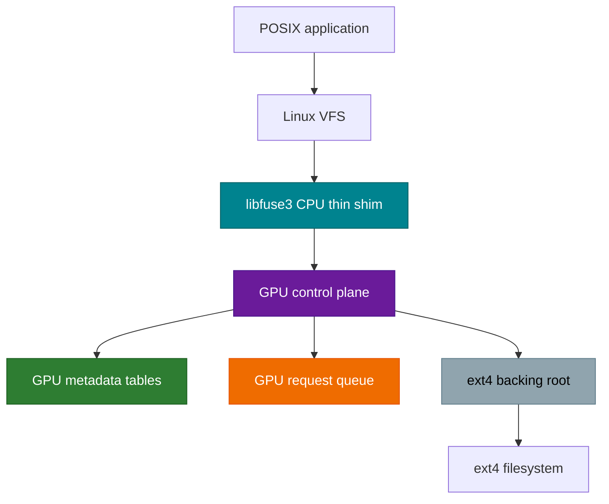
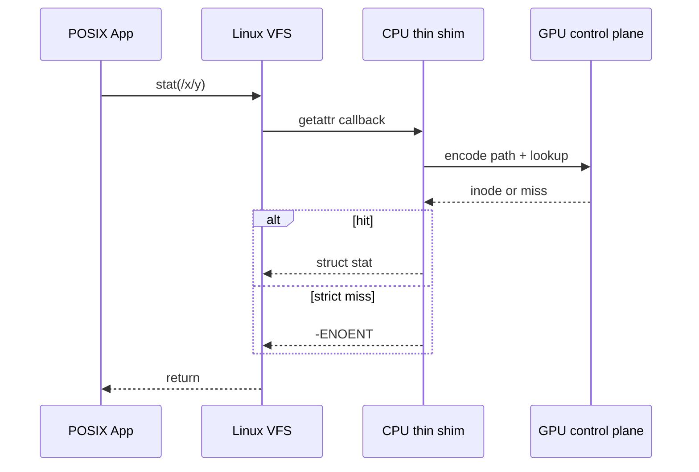
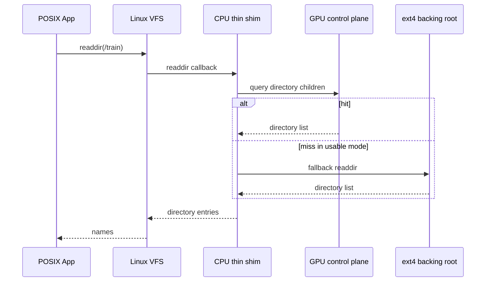
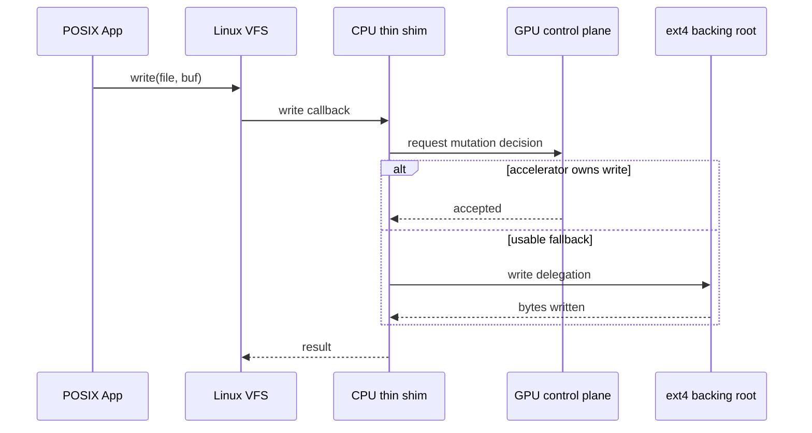

# 📘 GAMA System Specification (SYSSPEC v2.1)

> **Document status**: READY_FOR_IMPLEMENTATION  
> **Target platform**: WSL2 (Ubuntu 24.04.2) + CUDA 12.x + libfuse3  
> **System**: GPU-assisted metadata accelerator for ext4-like filesystems

---

## 1. System Goal

GAMA accelerates metadata-heavy filesystem operations by moving metadata control logic to GPU and keeping CPU as a thin FUSE ingress layer.

### Primary objective
- Accelerate `stat/getattr`, `readdir`, and metadata mutation paths.
- Make GPU the owner of metadata lookup, scheduling, batching, and mutation decisions.
- Keep the CPU layer limited to request marshaling, result return, and fallback enforcement.
- Use an ext4 backing root in usable mode for durable content and explicit fallback.

### Non-goals
- GAMA is not a full replacement filesystem.
- GAMA does not replace ext4 durability.
- GAMA does not require a new on-disk format.
- GAMA does not promise zero-CPU syscalls.

---

## 2. Operating Modes

| Mode | Semantics | Miss behavior | Intended use |
|---|---|---|---|
| strict | accelerator-only | return `-ENOENT` | benchmark, evaluation, correctness of accelerator path |
| usable | accelerator + fallback | consult ext4 backing root | engineering validation, practical integration |

### Mode invariants
- strict mode must never silently fallback.
- usable mode must log or surface fallback decisions.
- CPU must not make primary metadata decisions in either mode.

---

## 3. Architecture Overview



### Design rule
- CPU thin shim only packages and returns.
- GPU owns metadata state and dispatch policy.
- ext4 backing root is only a fallback/data anchor in usable mode.

---

## 4. Module Contracts

The project is organized into five modules. Each module below is written in SYSSPEC style: `[RELY]`, `[GUARANTEE]`, function contract, then concurrency contract.

---

### Module A: `path_encoder`

#### [RELY]
- `EncodedKey { uint64_t value; uint32_t depth; }`
- `PathConfig { std::string mount_point; uint32_t max_depth; uint32_t bits_per_level; }`
- `std::string normalize_path(const std::string& path)`
- no shared lock required

#### [GUARANTEE]
- `EncodedKey encode_path(const std::string& path, const PathConfig& cfg);`
- deterministic result for same `(path, cfg)`
- parent and child paths map to different keys unless collision occurs in the configured bit budget
- invalid input returns `INVALID_KEY` or throws only for malformed path syntax

#### Functional contract
- **Pre-condition**
  - `path` is a valid absolute or mount-relative path string
  - `cfg.mount_point` is non-empty
  - `cfg.max_depth > 0`
  - `cfg.bits_per_level` is in `[1, 16]`
- **Post-condition**
  - normalized path is canonicalized
  - valid path returns a non-zero key unless reserved
  - path deeper than `cfg.max_depth` returns `INVALID_KEY`
- **Invariant**
  - encoding is stable across calls within the same process and config

#### Concurrency contract
- stateless and thread-safe
- no locking required

---

### Module B: `gpu_index_adapter`

#### [RELY]
- `INVALID_INODE == 0`
- `IndexStats { p50_latency_us, p99_latency_us, throughput_qps, gpu_util_percent, vram_usage_bytes, query_count, miss_count }`
- `TrainingConfig { index_type, sample_ratio, max_epochs, max_vram_mb }`
- `cudaStream_t` may be treated as opaque in stub builds

#### [GUARANTEE]
- `class IGPUIndex` with methods:
  - `train(...)`
  - `batch_lookup(...)`
  - `save(...)`
  - `load(...)`
  - `get_stats() const`
  - `enable_profiling(bool)`
  - `get_vram_usage() const`
- `create_index(const std::string& type)` creates a backend-compatible index object
- `destroy_index(IGPUIndex*)` releases it

#### Functional contract
- **Pre-condition**
  - training keys and values are equal-length
  - lookup input may be empty only if caller explicitly accepts empty output
  - backend type is supported
- **Post-condition**
  - `train` makes later lookups valid for trained keys
  - `batch_lookup` preserves input order in output
  - misses return `INVALID_INODE`
  - `save/load` round-trips trained state or fails without partial corruption
- **Invariant**
  - after `train` or `load`, the index behaves as a read-mostly control-plane structure

#### Concurrency contract
- public lookup API is safe for concurrent calls if backend implementation preserves internal synchronization
- training is single-writer
- profiling state changes must not invalidate lookup results

---

### Module C: `config_manager`

#### [RELY]
- `nlohmann`-style parser abstraction via `parse_json`
- `ValidationError`
- config file is a JSON object

#### [GUARANTEE]
- `FSConfig load_config(const std::string& filepath);`
- `void validate_config(const FSConfig& cfg);`
- config contains explicit fields for mount, backend, mode, and benchmark

#### Functional contract
- **Pre-condition**
  - file exists and is readable
  - JSON root is an object
- **Post-condition**
  - returned config is validated and normalized
  - missing required fields raise `ValidationError`
- **Invariant**
  - config values represent one coherent runtime mode
  - `strict_mode` and `fallback_on_miss` must not conflict

#### Data model extension
- `FSConfig.fs.mount_point`
- `FSConfig.fs.backing_root`
- `FSConfig.fs.strict_mode`
- `FSConfig.fs.fuse_opts`
- `FSConfig.index.type`
- `FSConfig.index.training.sample_ratio`
- `FSConfig.index.training.key_encoding`
- `FSConfig.index.inference.batch_size`
- `FSConfig.index.inference.fallback_on_miss`
- `FSConfig.index.resource.max_vram_bytes`
- `FSConfig.benchmark.warmup_iters`
- `FSConfig.benchmark.metrics`

#### Concurrency contract
- immutable after load
- no shared mutable state

---

### Module D: `fuse_ops`

#### [RELY]
- `GPULearnedFS` runtime state
- FUSE 3 callback ABI
- GPU control plane interface
- ext4 backing root path from config
- perfetto tracing utilities

#### Runtime state contract
```cpp
struct GPULearnedFS {
    IGPUIndex* index;
    PathConfig path_cfg;
    std::string mount_point;
    std::string backing_root;
    bool strict_mode;
    bool usable_mode;
    bool gpu_master_enabled;
    mutable std::mutex global_lock;
    std::map<std::string, NodeEntry> nodes;
    std::map<std::string, std::vector<std::string>> children;
    std::uint64_t next_inode;
};
```

#### [GUARANTEE]
- exported callbacks:
  - `gpufs_getattr`
  - `gpufs_readdir`
  - `gpufs_open`
  - `gpufs_create`
  - `gpufs_unlink`
  - `gpufs_mkdir`
  - `gpufs_rmdir`
  - `gpufs_rename`
  - `gpufs_truncate`
  - `gpufs_read`
  - `gpufs_write`
  - `gpufs_utimens`
- `build_fuse_operations()` returns a valid `fuse_operations`
- `set_active_fs()` installs the current runtime state

#### Functional contract
- **Pre-condition**
  - active FS is installed before FUSE main loop
  - path arguments are relative to mount root or normalized by the shim
- **Post-condition**
  - `getattr`/`readdir` expose consistent directory metadata
  - create/mkdir/unlink/rmdir/rename/truncate/write update runtime state
  - usable mode may fallback to ext4 backing root when accelerator misses
- **Invariant**
  - strict miss never consults backing root
  - directory child mapping remains consistent with node table

#### Concurrency contract
- CPU-side lock protects request handoff and runtime maps
- GPU control plane is the conceptual owner of metadata decision state
- if a request is upgraded to fallback, the fallback path must be serialized with the same request scope

---

### Module E: `benchmark_runner`

#### [RELY]
- FUSE client API
- perfetto flush
- stable workload tree under mount point

#### [GUARANTEE]
- `std::vector<BenchmarkResult> run_benchmarks(const std::string& mount_point, const FSConfig& cfg);`
- benchmark scenarios include `random_stat`, `seq_readdir`, `mixed_rw`
- result records latency percentiles and throughput

#### Functional contract
- **Pre-condition**
  - mount point is valid
  - workload tree exists
- **Post-condition**
  - one result per scenario
  - trace artifacts are flushed
- **Invariant**
  - all baselines use the same workload generator and same path set

#### Concurrency contract
- benchmark driver does not mutate filesystem state except through the tested API

---

## 5. Request Semantics

### 5.1 `getattr` / `stat`
- path is normalized
- GPU index resolves inode first
- if node table already contains the entry, the node table is authoritative for the prototype runtime
- strict miss returns `-ENOENT`
- usable miss may consult `backing_root`

### 5.2 `readdir`
- directory entry list comes from runtime children map
- `.` and `..` must always be emitted
- missing directory returns `-ENOENT`
- non-directory path returns `-ENOTDIR`

### 5.3 `create` / `mkdir`
- parent must exist and be a directory
- duplicate target returns `-EEXIST`
- new inode allocated from runtime state
- children mapping updated atomically with node table

### 5.4 `unlink` / `rmdir`
- non-existing target returns `-ENOENT`
- unlink on directory returns `-ENOENT` or `-EISDIR` depending on implementation path; final code should standardize this
- `rmdir` on non-empty directory returns `-ENOTEMPTY`

### 5.5 `rename`
- source must exist
- target parent must exist
- target existing path handling must be explicit
- directory subtree move must preserve child mapping consistency

### 5.6 `truncate` / `read` / `write`
- file only; directory access returns `-EISDIR`
- negative offsets return `-EINVAL`
- write extends size as needed
- truncate shrinks or grows the byte buffer

---

## 6. Sequence Diagrams

### 6.1 `getattr` in strict mode



### 6.2 `readdir` in usable mode



### 6.3 `write` mutation path



---

## 7. Error-Handling Rules

- invalid config fields must fail fast with field-specific messages
- request path normalization errors return `-EINVAL`
- strict mode must not mask misses with fallback
- usable mode fallback must be observable in trace logs
- partial state updates are not acceptable inside a single mutation callback

---

## 8. Implementation Boundary

### CPU thin shim responsibilities
- parse config
- install active runtime state
- host FUSE callbacks
- submit request to GPU control plane abstraction
- enforce strict/usable mode
- return syscall-compatible errors

### GPU control plane responsibilities
- maintain metadata tables
- resolve path keys
- schedule and batch lookups
- decide mutation acceptance
- provide stats for tracing and benchmarks

### ext4 backing root responsibilities
- durable store in usable mode
- fallback data source for lookup and file mutations
- does not replace GPU metadata ownership

---

## 9. Acceptance Criteria

The spec is acceptable when all of the following hold:
- it describes a metadata accelerator, not a full filesystem
- modules have explicit rely/guarantee boundaries
- strict and usable semantics are disjoint and testable
- CPU/GPU responsibilities are clearly separated
- sequence diagrams cover lookup and mutation paths
- benchmark scenarios match the implementation plan

---

## 10. Summary

GAMA is a GPU-assisted metadata accelerator for ext4-like filesystems.

The implementation target is:
- GPU-owned metadata control plane
- CPU thin shim for FUSE ingress
- ext4 backing root in usable mode
- throughput-first validation on metadata-heavy workloads
